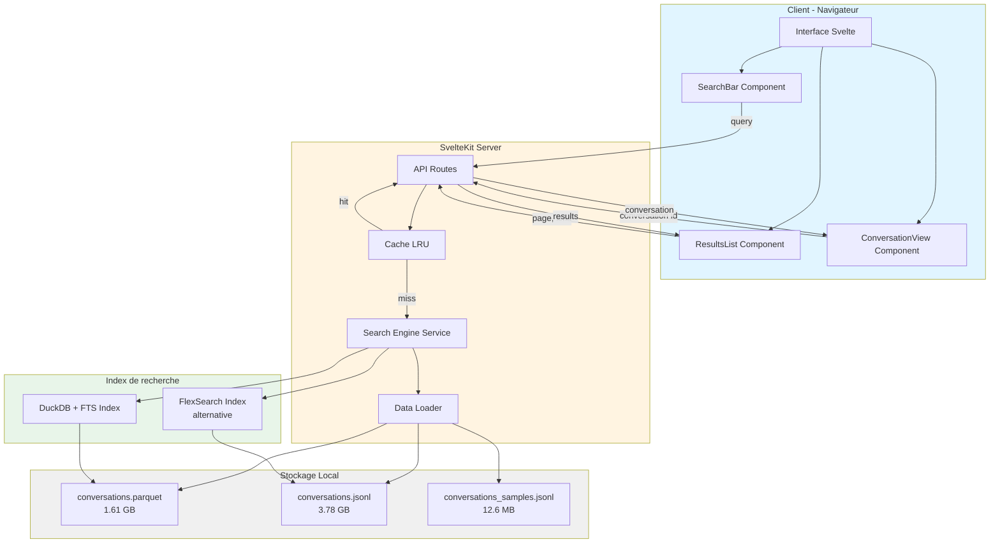
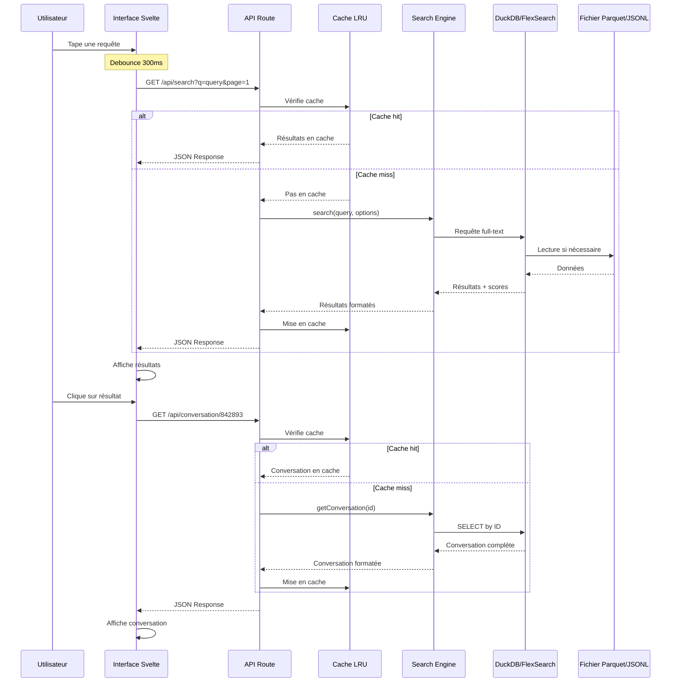
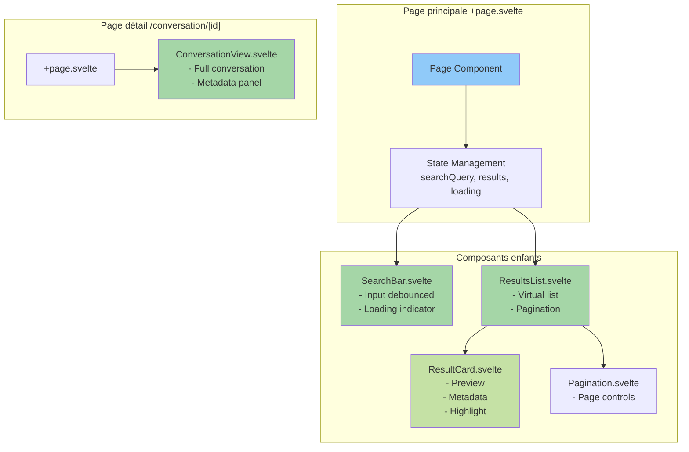
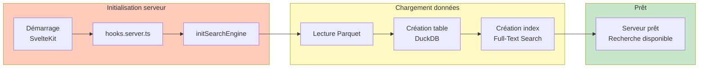
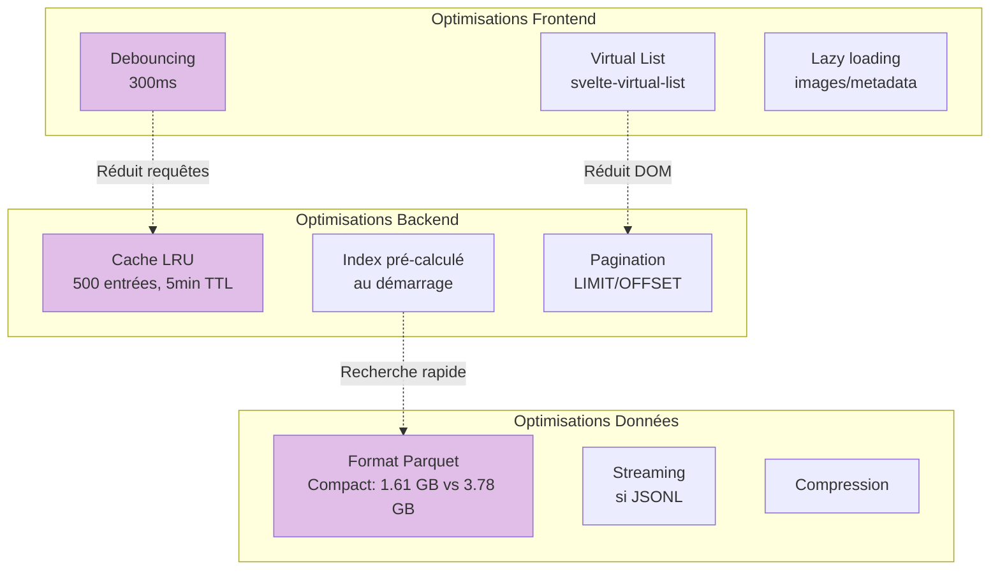
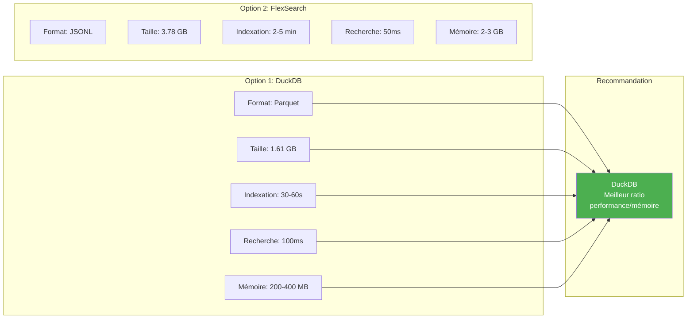

# Diagrammes d'architecture

## Flux de données et architecture globale

## Flux de recherche détaillé

## Architecture des composants Svelte

## Stratégie d'indexation - Option DuckDB

## Performance et optimisations

## Comparaison des solutions d'indexation

